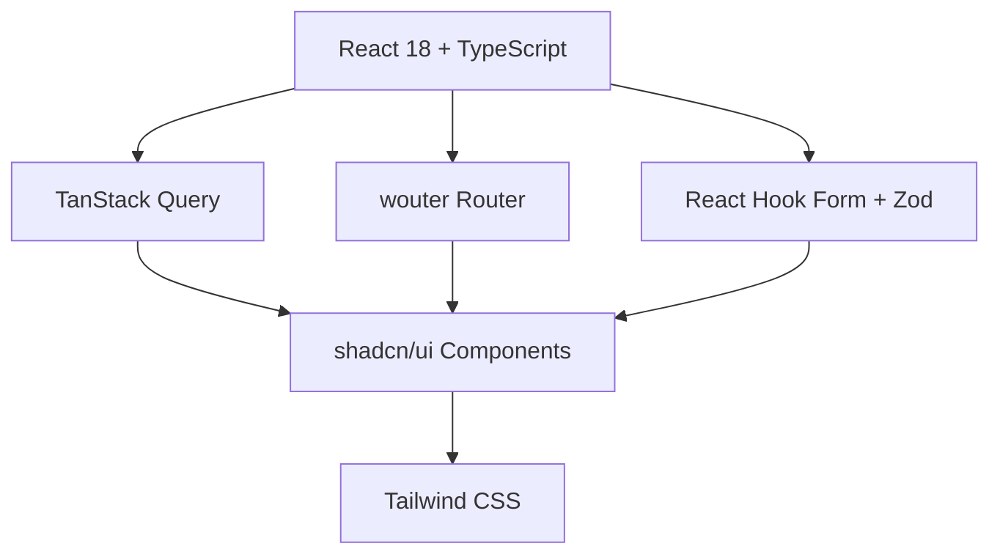
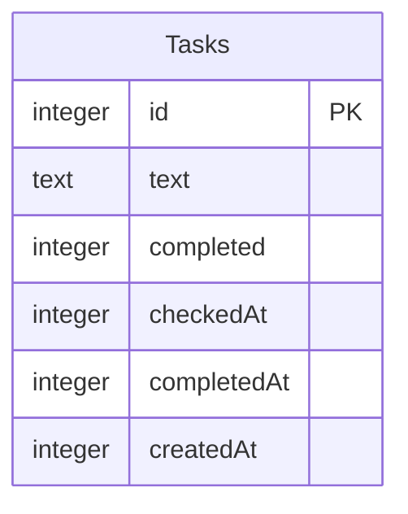

<div align="center">

# 🚀 スマートタスク管理

### _Smart Task Manager_


**Markdown で作成したタスクが 1 時間後に自動完了する、オフライン対応のシンプルなタスク管理アプリ**

📖 [ドキュメント](#技術スタック) • [🚀 今すぐ始める](#開発環境セットアップ) • [💻 macOSアプリ](#macos-アプリケーション)

---

</div>

## ✨ 主な機能

### 💾 オフライン対応

- 📱 **完全オフライン**: インターネット接続不要
- 🗄️ **ローカルストレージ**: SQLiteでデータを安全に保存
- 🔒 **プライバシー保護**: データは全てローカルに保存

### 📝 Markdown タスク管理

- ✏️ **リアルタイムエディター**: ライブプレビュー機能
- ☑️ **チェックボックス記法**: `- [ ]` / `- [x]` 対応
- 🔄 **一括インポート**: Markdown からタスク自動生成

### ⏰ 自動完了システム

- ⏲️ **1 時間タイマー**: チェック後自動完了
- 📈 **進捗追跡**: リアルタイム状態更新
- 🎯 **集中力向上**: 達成感を促進する仕組み

### 📊 インテリジェント分類

- 🟢 **アクティブタスク**: 進行中タスクの管理
- ✅ **完了タスク**: 達成済みタスクの履歴
- ⏳ **タイマータスク**: カウントダウン中タスク

---

## 🎨 美しい UI/UX

<div align="center">

|   🌙 ダークモード    | 📱 レスポンシブ  |       🎯 日本語対応        |   ⚡ 高速表示    |
| :------------------: | :--------------: | :------------------------: | :--------------: |
| 目に優しい暗色テーマ | モバイル完全対応 | 完全日本語インターフェース | 瞬時ロード・更新 |

</div>

## 🛠️ 技術スタック

<div>

### Frontend Architecture



</div>

#### 🎨 **Frontend**

-  **React 18** + **TypeScript**
-  **Vite** - Lightning fast dev server
-  **TanStack Query** - Smart data fetching
-  **wouter** - Lightweight routing
-  **Tailwind CSS** + **shadcn/ui**

#### ⚙️ **Backend**

-  **Node.js** + **Express**
-  **TypeScript** - Type safety
-  **Drizzle ORM** - Type-safe database
-  **SQLite** - Lightweight local storage

#### 🖥️ **Desktop App**

-  **Tauri** - Native app framework
-  **Rust** - System-level performance
- 🍎 **macOS Native** - Full system integration

## 🗄️ データベース設計

<div>



</div>

#### ✅ **Tasks Table (SQLite)**

```sql
id           INTEGER   PRIMARY KEY AUTOINCREMENT
text         TEXT      NOT NULL
completed    INTEGER   NOT NULL DEFAULT 0  (0=false, 1=true)
checkedAt    INTEGER   (Unix timestamp)
completedAt  INTEGER   (Unix timestamp)
createdAt    INTEGER   NOT NULL (Unix timestamp)
```

### 🎯 **シンプルな設計**

- **認証不要**: ユーザー管理なしのシンプルな構成
- **ローカル保存**: すべてのデータはローカルSQLiteに保存
- **高速アクセス**: 軽量なSQLiteで瞬時にデータアクセス

## 🔌 API エンドポイント

### ✅ **Task Management API**

```http
GET    /api/tasks            # 全タスク取得
GET    /api/tasks/active     # アクティブタスク
GET    /api/tasks/completed  # 完了タスク
GET    /api/tasks/timers     # タイマータスク
POST   /api/tasks            # タスク作成
PATCH  /api/tasks/:id        # タスク更新
DELETE /api/tasks/:id        # タスク削除
POST   /api/tasks/markdown   # Markdown一括作成
```

### 🔧 **System API**

```http
GET    /api/health           # システム状態確認
```

## 🚀 開発環境セットアップ

<div align="center">

### クイックスタート


</div>

#### 📋 **前提条件**

-  Node.js 18 以上
-  Git (クローン用)

#### 🏃‍♂️ **実行手順**

```bash
# 1️⃣ インストール
npm install

# 2️⃣ 開発サーバー起動
npm run dev
open http://localhost:3001
```

### ✨ **超簡単セットアップ**

- 🚫 **データベース設定不要**: SQLiteが自動で作成されます
- 🚫 **環境変数設定不要**: そのまま実行できます
- 🚫 **認証設定不要**: すぐに使い始められます

---

## 🖥️ macOS アプリケーション

このプロジェクトは **Tauri** を使ってネイティブ macOS アプリとしてビルドできます。

### 📦 **プロダクションビルド**

```bash
# macOSアプリをビルド (.dmg)
npm run tauri:build
```

### ✨ **ネイティブ機能**

- 🍎 **macOS 統合**: ネイティブメニューバー・ショートカット
- 🌙 **ダークモード**: システム設定に自動対応
- 🔒 **セキュリティ**: Rustベースの安全なアーキテクチャ
- 📱 **ウィンドウ管理**: macOS ネイティブな操作感
- 💾 **ローカルデータ**: `~/Library/Application Support/com.smarttask.manager/` に安全に保存

### 🎯 **Tauriの利点**

- ⚡ **高速**: Rustバックエンドで軽量・高速
- 🔐 **安全**: メモリ安全性とセキュリティを重視
- 📦 **小サイズ**: Electronより大幅に小さいアプリサイズ

## 📁 プロジェクト構成

<div>

```
📁 smart-task-manager/
┣ 📁 client/                    # 🎨 Frontend Application
┃ ┗ 📁 src/
┃   ┣ 📁 components/            # 🧩 React Components
┃   ┣ 📁 hooks/                 # 🪝 Custom Hooks
┃   ┣ 📁 lib/                   # 🛠️ Utilities & Helpers
┃   ┗ 📁 pages/                 # 📄 Page Components
┣ 📁 server/                    # ⚙️ Backend Services
┃ ┣ 📄 index.ts                 # 🚀 Server Entry Point
┃ ┣ 📄 routes.ts                # 🛣️ API Routes
┃ ┣ 📄 storage.ts               # 💾 Data Access Layer
┃ ┗ 📄 db.ts                    # 🗄️ SQLite Database Setup
┣ 📁 src-tauri/                 # 🖥️ Tauri Desktop App
┃ ┣ 📁 src/                     # 🦀 Rust Source Code
┃ ┣ 📄 tauri.conf.json          # ⚙️ Tauri Configuration
┃ ┗ 📄 Cargo.toml               # 📦 Rust Dependencies
┣ 📁 shared/                    # 🤝 Shared Resources
┃ ┗ 📄 schema.ts                # 📋 Type Definitions
┣ 📄 package.json               # 📦 Dependencies
┗ 📄 README.md                  # 📖 Documentation
```

</div>

---

## 🌟 主な特徴

<div align="center">

|   💾 **オフライン**    |  ⏰ **自動完了**   |   📝 **Markdown**    |   🖥️ **ネイティブ**   |
| :--------------------: | :----------------: | :------------------: | :--------------------: |
|  完全オフライン対応   |  1 時間後自動完了  | チェックボックス記法 |    Tauri macOSアプリ    |
| インターネット接続不要 | 集中力維持と達成感 |    使い慣れた記法    |   軽量・高速・安全     |

</div>

---

## 🤝 コントリビューション


### 貢献方法

1. 🍴 **Fork** このリポジトリ
2. 🌿 **ブランチ作成** (`git checkout -b feature/amazing-feature`)
3. 💾 **コミット** (`git commit -m 'Add amazing feature'`)
4. 📤 **プッシュ** (`git push origin feature/amazing-feature`)
5. 🔀 **プルリクエスト作成**

---

## 📄 ライセンス

<div align="center">


このプロジェクトは **MIT License** の下で公開されています

</div>

---

<div align="center">

## 🎯 **生産性を向上させる新しいタスク管理体験をお楽しみください！**

### Made with ❤️ by developers, for developers

[](/)
[](/)

---

_🚀 Let's build amazing productivity tools together! 🚀_

</div>
